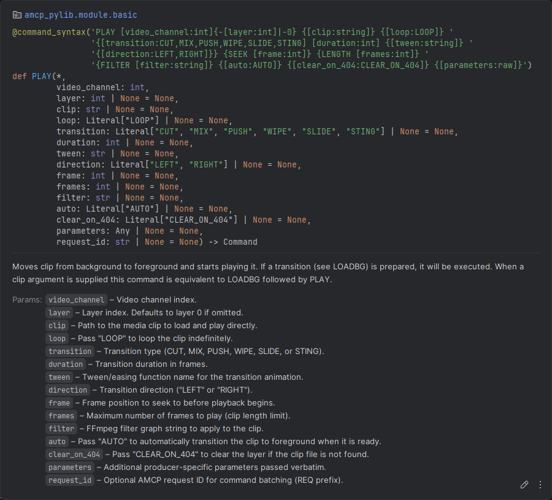

# Python AMCP Client Library
> v0.3.0

[](https://github.com/dolejska-daniel/amcp-pylib/actions/workflows/ci.yml)
[](https://pypi.org/project/amcp-pylib/)
[](https://pypi.org/project/amcp-pylib/)
[](https://pypi.org/project/amcp-pylib/)
[](https://www.paypal.me/dolejskad)

## Introduction
Welcome to the AMCP client library repository for Python!
The goal of this library is to provide simple and understandable interface for communication with CasparCG server.

Every command is a regular Python function with **explicit, named keyword-only parameters** and **full type annotations** — including `Literal` types for enum-like arguments and keyword flags — so your editor provides accurate argument hints and catches typos before runtime.

```python
# Parameters are keyword-only, required args have no default, optional ones default to None
LOADBG(channel=1, clip="AMB")
PLAY(video_channel=1, layer=10, loop="LOOP")
MIXER_FILL(video_channel=1, x=0.0, y=0.0, x_scale=0.5, y_scale=0.5)
LOG_LEVEL(level="DEBUG")
```



## Installation
```shell
pip install amcp-pylib
```

AMCP PyLib supports Python 3.9 and newer.

## Quickstart

Create commands directly when you want to inspect or log the AMCP message before sending it:

```python
from amcp_pylib.module.query import VERSION

command = VERSION(component="server")
print(str(command))
```

```shell
VERSION "server"
```

### Connecting to server
```python
from amcp_pylib.core import Client

client = Client()
client.connect("caspar-server.local", 6969)  # defaults to 127.0.0.1, 5250
```

Built-in support for `asyncio` module:
```python
import asyncio
from amcp_pylib.core import ClientAsync

client = ClientAsync()
asyncio.new_event_loop().run_until_complete(client.connect("caspar-server.local", 6969))
```

### Sending commands
```python
from amcp_pylib.core import Client
from amcp_pylib.module.query import VERSION, BYE

client = Client()
client.connect()

# with command syntax of "VERSION {[component:string]}"
response = client.send(VERSION(component="server"))
print(response)

response = client.send(BYE())
print(response)
```

```shell
<SuccessResponse(data=['2.5.0 69e8ad5 Stable'], code=201, code_description='VERSION')>
<InfoResponse(   data=[],                       code=0,   code_description='EMPTY')>
```

All supported protocol commands are listed and documented on CasparCG's [AMCP protocol page](https://casparcg.com/docs/wiki/protocols/amcp-protocol).
_Some commands may not be supported yet (in that case, please create issue (or pull ;) request)._

## Modern AMCP usage

AMCP PyLib targets CasparCG Server 2.4+ behavior while keeping the older documented command names available where practical. Commands are serialized as UTF-8 and always end with `\r\n`. String arguments are quoted only when the protocol needs it, and quotes, backslashes, and newlines are escaped using AMCP escape sequences.

```python
from amcp_pylib.core import Client
from amcp_pylib.module.basic import LOADBG, PLAY, STOP

client = Client()
client.connect()

client.send(LOADBG(channel=1, layer=10, clip="AMB", loop="LOOP", auto="AUTO"))
client.send(PLAY(video_channel=1, layer=10))
client.send(STOP(video_channel=1, layer=10))
```

### Templates and data

Template data is passed as an XML string following the CasparCG `<templateData>` format.
A named dataset can be stored once with `DATA_STORE` and then referenced by name in `CG_ADD`.

```python
from amcp_pylib.module.data import DATA_STORE
from amcp_pylib.module.template import CG_ADD, CG_PLAY, CG_UPDATE, CG_CLEAR

# Store a reusable dataset — data is an XML string
client.send(DATA_STORE(
    name="lower-thirds/guest",
    data='<templateData><componentData id="name"><data id="text" value="Ada Lovelace"/></componentData></templateData>',
))

# Reference the stored dataset by name, or pass inline XML directly
client.send(CG_ADD(video_channel=1, layer=20, cg_layer=1, template="lower-third", play_on_load=1, data="lower-thirds/guest"))
client.send(CG_PLAY(video_channel=1, layer=20, cg_layer=1))

# Update with new inline XML
client.send(CG_UPDATE(
    video_channel=1, layer=20, cg_layer=1,
    data='<templateData><componentData id="name"><data id="text" value="Grace Hopper"/></componentData></templateData>',
))
client.send(CG_CLEAR(video_channel=1, layer=20))
```

### Mixer transforms

```python
from amcp_pylib.module.mixer import MIXER_FILL, MIXER_OPACITY, MIXER_COMMIT

client.send(MIXER_FILL(video_channel=1, layer=10, x=0.1, y=0.1, x_scale=0.8, y_scale=0.8, duration=25, tween="easeinsine"))
client.send(MIXER_OPACITY(video_channel=1, layer=10, opacity=0.75))
client.send(MIXER_COMMIT(video_channel=1))
```

### Raw commands and request ids

Use raw commands for server features that do not have a helper yet, or for exact HELP output experiments against a live server.

```python
from amcp_pylib.core import Command
from amcp_pylib.module.query import BEGIN, COMMIT

client.send(BEGIN(request_id="batch-1"))
client.send(Command.raw("PLAY 1-10 AMB"))
client.send(COMMIT(request_id="batch-1"))

response = client.send_raw_command("HELP PLAY")
```

### Producer and consumer parameters

Parameters for producers and consumers can be passed as raw token lists so FFmpeg-style options with dashes remain separate AMCP tokens.

```python
from amcp_pylib.module.basic import ADD, PLAY

client.send(PLAY(video_channel=1, layer=1, clip="AMB", clear_on_404="CLEAR_ON_404"))
client.send(ADD(
    video_channel=1,
    consumer="STREAM",
    parameters=["udp://localhost:5004", "-vcodec", "libx264", "-preset", "ultrafast", "-format", "mpegts"],
))
```

### OSC subscription commands

CasparCG Server 2.4 added AMCP helpers to subscribe the AMCP client's IP address to OSC updates on any UDP port.

```python
from amcp_pylib.module.query import OSC_SUBSCRIBE, OSC_UNSUBSCRIBE

client.send(OSC_SUBSCRIBE(port=6250))
client.send(OSC_UNSUBSCRIBE(port=6250))
```

### Error handling

Responses preserve the numeric code, request id, header text, and data lines. Call `raise_for_status()` when you want 4xx and 5xx replies to become exceptions.

```python
from amcp_pylib.module.basic import PLAY
from amcp_pylib.exceptions import AMCPResponseError

response = client.send(PLAY(video_channel=1, clip="missing", clear_on_404="CLEAR_ON_404"))
try:
    response.raise_for_status()
except AMCPResponseError as exc:
    print(exc.response.code, exc.response.header_text, exc.response.data)
```

### Async usage

```python
import asyncio
from amcp_pylib.core import ClientAsync
from amcp_pylib.module.basic import PLAY

async def main():
    client = ClientAsync()
    await client.connect()
    response = await client.send(PLAY(video_channel=1, clip="AMB"))
    print(response)

asyncio.run(main())
```

## Compatibility notes

The CasparCG AMCP wiki is still useful, but it explicitly warns that not every command applies to versions newer than 2.0.x. CasparCG Server 2.4 adds `CLEAR ALL`, batching with `REQ`/`RES`, `CALLBG`, `CLEAR_ON_404`, and `OSC SUBSCRIBE` / `OSC UNSUBSCRIBE`. Some old query helpers such as selected `INFO` and `HELP` variants have varied across 2.2, 2.3, 2.4, and current source, so this library keeps escape hatches through `Command.raw()` and `send_raw_command()`.

## Public API

The stable public API is documented in [docs/public-api.md](docs/public-api.md).

Most users should import clients from `amcp_pylib.core`, command factories from `amcp_pylib.module` or its command-category modules, and response base/factory classes from `amcp_pylib.response`.
